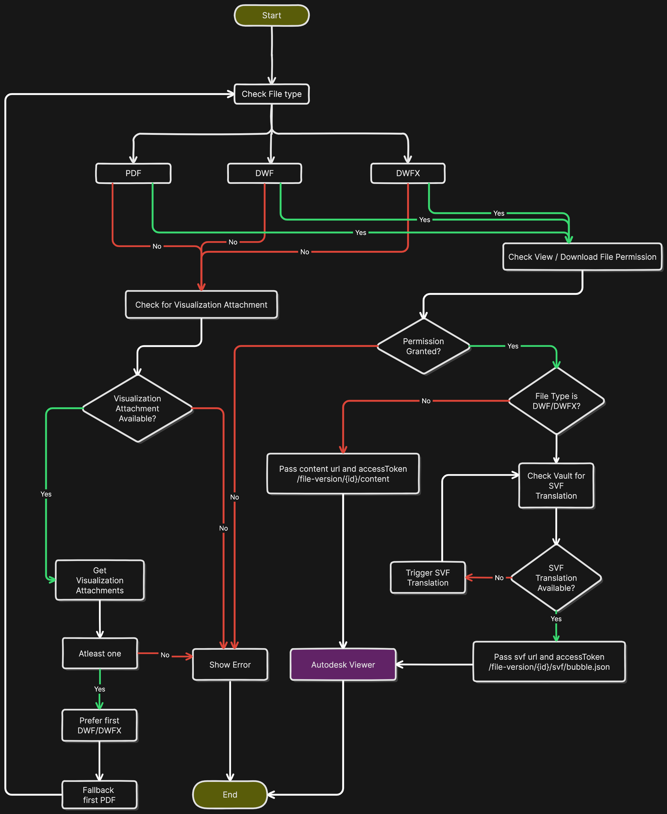

# Vault Web Demo
It is a Single Page Application (SPA), which renders on the client side (browser). Application routing is handled on the client side, rendering different UIs based on routing.

## Requirements
- Node.js (NPM)
- Editor - VS Code

## Framework and Libraries
- Build tool
    - Application bundle, Dev Server, Api Proxy etc - [Vite.js](https://vitejs.dev/)
- Frontend
    - UI Library - [React.js](https://react.dev/)
    - UI Components Library - [Ant Design](https://ant.design/)
    - Application routing - [Tanstack Router](https://tanstack.com/router/latest)
    - API tool - [Alova.js](https://alova.js.org/)
    - State Management - [Valtio](https://valtio.pmnd.rs/)
    - Rest Api Playground - [RapiDoc](https://rapidocweb.com/)


## Build Project
- On Command Prompt / Terminal  cd, enter the project directory.
- `npm install` - install the dependencies
- `npm run build`- build the project for production. It will generate HTML, CSS, and JS, and then copy all assets to the /dist folder. Later, we can serve it as a static file, allowing the browser to bootstrap the entire application from the client side.
- `npm run dev` - starts integrated dev server. It supports HMR and live-reloads the browser when the code changes..

The Vite dev server can make proxy API calls to another machine.
Refer 
[server.proxy - https://vitejs.dev/config/server-options#server-proxy](https://vitejs.dev/config/server-options#server-proxy)
[vite.config.js - vault-data-api-web-demo/vite.config.js](vault-data-api-web-demo/vite.config.js)

If you are using another build tool that does not support a proxy server, you can utilize the following npm packages to address the issue.
``` npx http-server --proxy <vault server> --proxy-options.changeOrigin true --cors```
For example:
``` npx http-server --proxy http://ecs-799f9ad3.ecs.ads.autodesk.com --proxy-options.changeOrigin true --cors```

This command starts a basic static file server in the current folder on port 8080. It switches to the proxy server when the requested resource is not found. All network calls to http://localhost:8080/* (excluding the resources in the folder where the proxy server is started) are routed through the proxy server.

Ref:
[http-server](https://www.npmjs.com/package/http-server)
[http-proxy](https://www.npmjs.com/package/http-proxy)

## API client code generation.
Alova.js helps with the generation of API client code based on the Open API Specification in JSON format. To learn how to configure and utilize this tool, please refer to the documentation.
[Alova VS Code Extension](https://alova.js.org/tutorial/getting-started/extension-integration)


## Features

- Vault Login
- Workspace
  - Explorer(<optional>id=<root | folderId>)
    - Folders
    - Files
      -  Viewer(id=<file-version-id>)
    - Links
   - Items
  - ChangeOrders
  - API Explorer

## Viewer Integration
Viewer is loaded in an iFrame. Once the translation is confirmed, pass the svf URL and token details to the viewer using window.postMessage.


